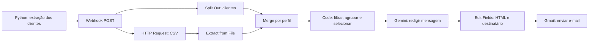
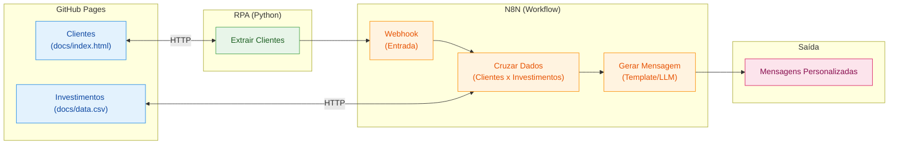

# Assistente de investimentos com Python, n8n e Gemini 

# A entrega acabou ficando divertida devido divergências com a IA. Boa leitura!

Projeto desenvolvido para o DIO - Santander Bootcamp 2026, a partir do desafio de integrar extração de dados com Python, processamento no n8n e geração de mensagens sobre investimentos.

O workflow recebe clientes fictícios, consulta uma base de investimentos, cruza os perfis, verifica o saldo disponível e seleciona até duas alternativas por pessoa. O Google Gemini redige uma mensagem personalizada, convertida em HTML para envio pelo Gmail.

Esta documentação foi produzida com assistência de IA a partir do arquivo `workflow.json`, das notas enviadas pelo autor e das decisões discutidas durante o desenvolvimento. A seção de autoria detalha essa colaboração.

## Minhas decisões no projeto

1. Reduzi os nodes para deixar o fluxo mais simples, usando o HTTP 200 do próprio webhook, sem um `Respond to Webhook` separado.
2. Usei o tratamento nativo de CSV do n8n, evitando código desnecessário.
3. Decidi separar os clientes com Split Out antes do Merge e cruzar as opções pelo perfil.
4. Integrei o filtro de saldo ao JavaScript, concentrando a seleção em um único node.
5. Por cuidado com os dados, decidi remover saldo e perfil após a seleção. A IA recebe apenas nome, produtos e mínimos; o e-mail fica no fluxo para o envio.
6. Mantive as regras de seleção no código e deixei a IA apenas redigir a mensagem.
7. Como decisão comercial, escolhi apresentar até duas opções com os maiores mínimos compatíveis com o cliente, sem associar isso a maior retorno.
8. Defini a formatação dos valores em reais e a transformação da mensagem em HTML no workflow, mantendo a resposta da IA em texto simples.

As decisões acima são do autor do projeto. O assistente apoiou sua implementação com escrita de código e expressões, conforme detalhado na seção de autoria.

## Escopo e arquivos

- `workflow.json`: exportação do workflow `DIOSantander2026`, com nove nodes.
- `README.md`: documentação do fluxo e das decisões de implementação.

O notebook Python faz parte da etapa de origem do projeto, mas não está nesta pasta e não foi inspecionado para esta documentação. Ele deve extrair os clientes da página e enviá-los ao webhook.

Fontes usadas pelo projeto:

- [Página de clientes fictícios](https://felthg.github.io/dio-lab-assistente-investimentos-rpa-n8n/).
- [CSV de investimentos](https://felthg.github.io/dio-lab-assistente-investimentos-rpa-n8n/data.csv).

O MVP do enunciado exige mensagens estáticas. Esta implementação acrescenta a redação com Gemini e a etapa de envio por e-mail.

## Fluxo



### 1. Webhook — receber os clientes

O node `Webhook` recebe uma requisição `POST` no caminho `clientes`. A estrutura esperada no corpo da requisição é:

```json
{
  "clientes": [
    {
      "nome": "Cliente Exemplo",
      "email": "cliente@example.com",
      "saldo": "R$ 3.200,00",
      "perfil": "Moderado"
    }
  ]
}
```

O autor optou por usar a resposta padrão do próprio webhook, HTTP 200, dispensando um node separado `Respond to Webhook`. No JSON, o modo de resposta não foi sobrescrito e a configuração do código de resposta usa os valores padrão.

Essa resposta confirma o recebimento da requisição. Ela não confirma que o Gemini terminou o processamento ou que o Gmail enviou os e-mails.

### 2. HTTP Request e Extract from File — consultar os investimentos

O `HTTP Request` baixa o CSV publicado no GitHub Pages como arquivo. O `Extract from File` transforma seu conteúdo em itens do n8n, com os campos `perfil`, `produto`, `minimo` e `rentabilidade`.

Foi utilizado o processamento nativo do n8n, sem código personalizado para interpretar o CSV.

### 3. Split Out e Merge — relacionar os perfis

O autor definiu o uso de Split Out para preparar os clientes e de Merge para cruzar os perfis.

O `Split Out` separa a lista `body.clientes` em itens individuais, colocando os dados de cada pessoa no campo `cliente`.

O `Merge` combina as duas entradas por correspondência de campos:

| Entrada | Origem | Campo de comparação |
| --- | --- | --- |
| Input 1 | Split Out | `cliente.perfil` |
| Input 2 | Extract from File | `perfil` |

O resultado esperado é um item por combinação de cliente e investimento do mesmo perfil. O Merge ainda não verifica o saldo. Os valores de perfil precisam estar padronizados entre as fontes.

### 4. Code in JavaScript — aplicar as regras e preparar a saída

O node processa todos os itens e concentra as seguintes operações:

1. Converte o saldo em formato brasileiro, como `R$ 3.200,00`, em número.
2. Converte o mínimo do CSV, como `1000`, em número.
3. Descarta combinações com conversão numérica inválida ou `saldo < minimo`.
4. Agrupa as opções por e-mail do cliente usando `Map`.
5. Ordena pelo valor mínimo em ordem decrescente, com desempate alfabético pelo produto.
6. Seleciona até duas opções por cliente com `.slice(0, 2)`.
7. Formata os mínimos selecionados em reais com `toLocaleString('pt-BR', ...)`.
8. Retorna somente nome e e-mail no objeto `cliente`, omitindo saldo e perfil.

Durante o desenvolvimento foi considerado e utilizado um Filter separado. Na exportação final, sua condição está incorporada ao Code; não existe um node Filter independente.

A omissão de saldo e perfil na saída e a apresentação dos mínimos em reais foram decisões do autor. Os trechos JavaScript foram redigidos com apoio do assistente para implementar esses requisitos.
(Nota do autor:" - Na verdade eu editei o script manualmente e ela esta reclamando a autoria, achei engraçado e está tudo bem!. Rs ") 

**Regra de seleção:** apresentar até duas opções com os maiores valores mínimos entre as alternativas compatíveis com o perfil e o saldo. Essa foi uma escolha do autor para a apresentação comercial das opções, não uma exigência do curso nem uma classificação por rentabilidade.

As opções são alternativas individuais. O código verifica cada mínimo separadamente; não exige que a soma dos dois caiba no saldo e não monta uma carteira.

Exemplo ilustrativo: para um cliente moderado com R$ 7.800, as opções com mínimos de R$ 5.000, R$ 1.000 e R$ 1.000 resultam na seleção do Fundo Multimercado e do CDB Prefixado. Entre os dois mínimos de R$ 1.000, o nome do produto define o desempate.

### 5. Message a model1 — redigir com Gemini

O node usa o modelo configurado como `models/gemini-flash-lite-latest`. Seu papel é redigir o texto; as regras de seleção já foram executadas antes.

Para cada item de cliente, o prompt inclui somente:

```json
{
  "nome": "Cliente Exemplo",
  "investimentos": [
    {
      "produto": "CDB Prefixado",
      "minimo": "R$ 1.000,00"
    }
  ]
}
```

O e-mail permanece no fluxo para definir o destinatário, mas não é incluído no prompt. O campo `rentabilidade` permanece na saída do Code, porém também não é enviado ao modelo. Saldo e perfil já foram removidos da saída do Code; continuam presentes nos nodes anteriores e no histórico de execução.

O prompt pede uma mensagem breve e acolhedora em português, preservação dos produtos e mínimos, apresentação das alternativas individualmente e ausência de informações inventadas ou promessas de retorno. Exige texto simples e o aviso final: “Simulação educacional com dados fictícios.”

O prompt exportado pede encerramento cordial, mas não fixa uma assinatura ou despedida específica. Não há ferramentas adicionais configuradas para o Gemini.

### 6. Edit Fields — preparar HTML e destinatário

A decisão de formatar a mensagem para envio em HTML foi do autor. O assistente ajudou a escrever a expressão que implementa essa transformação.

O texto é lido em `content.parts[0].text`. O node cria dois campos:

| Campo | Tratamento |
| --- | --- |
| `html` | Escapa `&`, `<` e `>`, converte quebras de linha em `<br>` e envolve o conteúdo em uma `<div>` com fonte Arial e espaçamento entre linhas. |
| `email` | Recupera `cliente.email` do item associado no node `Code in JavaScript`. |

O escape evita que eventuais tags presentes no texto gerado sejam interpretadas como HTML. A IA escreve o conteúdo, enquanto a expressão do workflow define a apresentação básica do e-mail.

O destinatário vem do dado original, usando `$('Code in JavaScript').item.json.cliente.email`, e não de uma resposta gerada pelo modelo.

### 7. Send a message — enviar pelo Gmail

O node Gmail recebe:

- Destinatário: `{{ $json.email }}`.
- Assunto: `DIO Santander Boot Camp 2026`.
- Mensagem: `{{ $json.html }}`.

O fluxo foi organizado para gerar uma mensagem por cliente com opções selecionadas. A exportação não contém credencial Gmail vinculada a esse node; ela precisa ser configurada na instância utilizada para execução.

## Como reproduzir

1. Importe `workflow.json` no n8n.
2. Configure sua credencial Google Gemini e confirme a disponibilidade do modelo escolhido. A referência de credencial exportada não substitui a configuração na nova instância.
3. Configure a credencial Gmail e confirme o formato HTML da mensagem.
4. Confira o acesso ao CSV e seus campos.
5. Use endereços de teste sob seu controle antes de executar o envio. Os e-mails da base fictícia não devem ser presumidos como caixas de teste disponíveis ao autor.
6. Inicie a escuta de teste do webhook e configure no Python a URL de teste exibida pelo n8n.
7. Envie o objeto `clientes` e confira a saída dos nodes até o Edit Fields antes de habilitar o envio real.
8. Para uso fora do modo de teste, publique/ative o workflow e use a URL de produção fornecida pela instância.

O arquivo exportado está com `active: false`. Esta documentação resulta de inspeção do JSON e da conversa; não representa uma nova execução de ponta a ponta nem confirmação de entrega dos e-mails.

## Limites da implementação

- Clientes sem correspondência de perfil ou sem opção que caiba no saldo não chegam à etapa de mensagem.
- Se apenas uma opção for elegível, somente ela é apresentada.
- O agrupamento pressupõe um e-mail único por cliente.
- A conversão de saldo pressupõe uma string no formato brasileiro usado na base. Não há validação completa de campos ausentes, negativos, duplicados ou conteúdo malformado.
- Não há cálculo de carteira, análise de rentabilidade ou distribuição do saldo.
- O código não implementa deduplicação de execuções: reenviar uma requisição pode gerar novos envios.
- Não há validação automática do conteúdo produzido pela IA, tratamento personalizado de falhas ou confirmação de entrega. As instruções do prompt orientam o modelo, mas não garantem fidelidade absoluta.
- A extração da resposta do Gemini pressupõe texto em `content.parts[0].text`.

## Autoria e uso de IA

O autor enviou suas próprias notas e esclarecimentos de autoria para orientar esta documentação. O assistente organizou e reescreveu esse material, conferindo a descrição técnica com o workflow exportado. As ideias de usar Split Out e Merge, omitir os dados após a seleção e formatar a saída são do autor; a assistência na escrita das expressões e do JavaScript não transfere a autoria dessas decisões.

| Participação | Contribuição |
| --- | --- |
| Autor do projeto — concepção e implementação no n8n | Definiu a simplificação do fluxo, o processamento nativo do CSV, o uso de Split Out e Merge, a integração do filtro ao Code, a omissão de saldo e perfil, a formatação dos valores e do e-mail e o critério das duas opções. Montou e configurou os nodes, escolheu Gemini e realizou os testes relatados. |
| Assistente de IA — apoio ao código e às configurações | Escreveu os trechos JavaScript de conversão, filtragem, agrupamento, ordenação, seleção, formatação monetária e omissão dos campos a partir dos requisitos do autor. Ajudou na configuração dos nodes e nas expressões para recuperar o destinatário e converter texto em HTML. |
| Prompt — elaboração assistida | O autor definiu o uso da IA para redigir as mensagens e pediu ajustes de tom, estrutura e tamanho. O assistente apoiou a redação e revisão do prompt, que foi configurado e ajustado pelo autor. |
| Documentação — notas do autor e redação assistida | O autor forneceu as notas e esclareceu suas decisões. O assistente estruturou o README e descreveu o funcionamento com base nesse material e no JSON. |
| Gemini durante a execução | Gera o corpo dos e-mails com base nos dados já selecionados. Não é responsável pelas regras de elegibilidade nem pela escolha do destinatário. |
| Material do curso | Segundo o enunciado fornecido, oferece a página simulada, o CSV e o notebook inicial de extração. A autoria do notebook e eventuais alterações locais não foram auditadas nesta pasta. |

A redução de nodes foi uma decisão de simplificação do autor. Não foram realizados benchmarks para afirmar ganho de velocidade ou redução mensurada de custo.


# Criando um Assistente de Investimentos com RPA e IA Generativa

## Descrição

Aprenda na prática como criar um fluxo de automação inteligente combinando técnicas de RPA (Robotic Process Automation) com workflows de IA no N8N.

Neste desafio, você vai construir um assistente de investimentos automatizado. O fluxo começa com a extração de dados de clientes em uma página web usando Python, passa pela orquestração de um workflow no N8N e termina com a geração de mensagens personalizadas para cada perfil de investidor.

O projeto foi pensado para ser simples e acessível, mesmo para quem está dando os primeiros passos em Python e automação. A ideia é que você entenda o conceito de RPA de forma leve e aplique tudo em um cenário realista do mercado financeiro.

## Objetivo do Projeto

Desenvolver um pipeline de automação que:

1. **Coleta dados de clientes** de uma página web simulada usando Python
2. **Processa as informações** através de um workflow no N8N
3. **Cruza perfis de investidor** com uma base de opções de investimento
4. **Gera mensagens personalizadas** para cada cliente

Ao final, você terá um sistema funcional que demonstra como empresas do setor financeiro podem automatizar a comunicação com clientes de forma inteligente.

## Arquitetura do Projeto



## Tecnologias e Ferramentas

O projeto utiliza ferramentas gratuitas e acessíveis, organizadas conforme cada etapa do fluxo:

| Etapa | Ferramenta | Função |
|-------|-----------|--------|
| Hospedagem | GitHub Pages | Servir a página de clientes e o CSV de investimentos |
| Extração (RPA) | Python + BeautifulSoup | Coletar dados dos clientes via web scraping |
| Orquestração | N8N | Processar dados, cruzar perfis e gerar mensagens |
| Geração com IA | Agente de IA no N8N | Criar mensagens personalizadas com LLM (desafio extra) |

Além dessas, você pode usar IAs generativas como **Gemini**, **Claude** ou **ChatGPT** como copilotos para auxiliar na escrita de código e tirar dúvidas ao longo do desenvolvimento.

## Roteiro do Desafio

### Etapa 1: Entenda o Projeto

Antes de começar, explore o repositório base que já contém a estrutura inicial:

1. **Página de Clientes (`docs/index.html`):** Uma página HTML hospedada no GitHub Pages com uma lista de clientes fictícios contendo nome, email, saldo e perfil de investidor (Conservador, Moderado ou Arrojado). Disponível online [neste link](https://digitalinnovationone.github.io/dio-lab-assistente-investimentos-rpa-n8n).
2. **Dados de Investimentos (`docs/data.csv`):** Um arquivo CSV também hospedado no GitHub Pages com opções de investimento organizadas por perfil. Disponível online [neste link](https://digitalinnovationone.github.io/dio-lab-assistente-investimentos-rpa-n8n/data.csv).
3. **Script de RPA (`src/extrair_clientes.ipynb`):** Um notebook Python que acessa a página de clientes e extrai os dados da tabela usando BeautifulSoup.

> 🤖 **Por que o script é considerado RPA?** Ele faz exatamente o que um humano faria manualmente: abre uma página, lê os dados de uma tabela e os envia para outro sistema. A diferença é que o "robô" (código) executa isso automaticamente. Essa abordagem é útil quando não existe uma API disponível ou quando precisamos integrar sistemas legados.

### Etapa 2: Configure o Ambiente

1. Faça um **fork** do repositório base para sua conta do GitHub
2. Crie uma conta no [N8N Cloud](https://n8n.io/) ou instale localmente
3. Abra o notebook `src/extrair_clientes.ipynb` no [Google Colab](https://colab.research.google.com/) e execute para entender o fluxo de extração

> 💡 **Atenção:** O script já extrai os dados, mas o envio ao N8N está comentado (`TODO`). Você vai configurar a URL do Webhook após criá-lo na próxima etapa.

### Etapa 3: Desenvolva o Workflow no N8N

Este é o coração do desafio! Monte um fluxo que:

1. Receba os dados dos clientes via Webhook (copie a URL gerada e configure no script Python)
2. Leia o arquivo `docs/data.csv` com as opções de investimento
3. Cruze o perfil de cada cliente com a opção adequada
4. Gere uma mensagem de recomendação para cada cliente

### Etapa 4 (MVP): Mensagens Estáticas

Para a versão mínima, use templates de mensagem fixos baseados no perfil:

- **Conservador:** Foco em renda fixa e segurança
- **Moderado:** Mix equilibrado entre renda fixa e variável
- **Arrojado:** Ênfase em ações e maior potencial de retorno

### Etapa 5 (Desafio): Integração com IA Generativa

Conecte o Agente de IA do N8N a um modelo como Gemini ou GPT para:

- Analisar o contexto do cliente (saldo, perfil)
- Gerar mensagens únicas e personalizadas
- Criar recomendações mais inteligentes e humanizadas

## Entregáveis

### MVP (Mínimo Viável)

- [ ] Repositório forkado com o workflow N8N implementado
- [ ] Workflow N8N exportado (`n8n/workflow.json`) com mensagens estáticas
- [ ] Script de RPA integrado ao Webhook do N8N
- [ ] Print ou vídeo demonstrando o fluxo funcionando de ponta a ponta

### Desafio Completo

- [ ] Todos os itens do MVP
- [ ] Integração com Agente de IA no N8N
- [ ] Mensagens geradas dinamicamente via LLM
- [ ] Documentação explicando as decisões técnicas

## Estrutura do Repositório

```
📁 dio-lab-assistente-investimentos-rpa-n8n/
├── 📄 README.md
├── 📁 src/
│   └── 📄 extrair_clientes.ipynb   # ✅ Notebook Python (já implementado, falta só o TODO)
├── 📁 n8n/
│   └── 📄 workflow.json            # 🎯 Seu desafio: exportar o workflow aqui
└── 📁 docs/
    ├── 📄 index.html               # ✅ Página de clientes (já implementado)
    └── 📄 data.csv                 # ✅ Opções de investimento (já implementado)
```

## Prompts Úteis para Copilotos de IA

| Tarefa | Sugestão de Prompt |
|--------|-------------------|
| Gerar dados fictícios | "Crie 10 clientes fictícios com nome, email, saldo e perfil de investidor em JSON" |
| Entender código | "Explique o que faz a biblioteca BeautifulSoup em Python" |
| Debugar erros | "Meu script Python está dando erro X, o que pode ser?" |
| Montar workflow | "Como configuro um webhook no N8N para receber dados JSON?" |

## Referências

- [Documentação do N8N](https://docs.n8n.io/)
- [BeautifulSoup: Web Scraping com Python](https://realpython.com/beautiful-soup-web-scraper-python/)
- [GitHub Pages: Guia Rápido](https://pages.github.com/)

---

**Bons estudos e mãos à obra** 🚀

Se tiver dúvidas, lembre-se: a melhor forma de aprender é experimentando. Erre, corrija e celebre cada pequena vitória no caminho.
